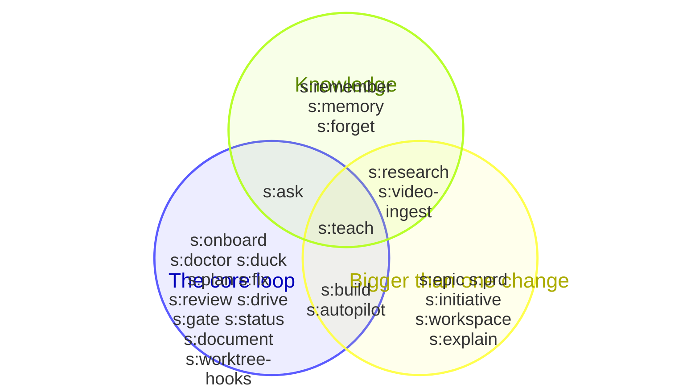

<!-- doc-type: reference -->

# Command cheatsheet

A lookup reference for the `/s:` commands and the `shipd` CLI — not a
walkthrough. New to shipd? Start with [Getting started](getting-started.md)
instead; come back here once you know the loop and just need the invocation
you forgot.

## Conventions

Flags shared across several verbs, stated once here instead of on every row
below:

- `--json` — emit machine-readable JSON instead of the text report.
- `--root DIR` — run against a repository root other than the current
  directory.

## How the skills overlap

## /s: commands

| Command | What it does | Example |
|---|---|---|
| `/s:ask` | Ask the oracle before interrupting a human — a cited recommendation, or a queued question. | `/s:ask Should the new endpoint require auth?` |
| `/s:autopilot <epic> [detached]` | Drive an approved epic's unplanned members to shipped PRs unattended. | `/s:autopilot export-cli` |
| `/s:build [change]` | Plan, delegate to execution sub-agents, verify, and ship a change end to end. | `/s:build export-json-flag` |
| `/s:doctor` | Diagnose a shipd environment and run only the remedies you consent to. | `/s:doctor` |
| `/s:document` | Author or revise a doc against the shipd documentation standard, then lint it clean. | `/s:document Rewrite docs/api-keys.md as a reference` |
| `/s:drive` | Drive a real browser to operate an app, verify a change, and optionally record a branded demo. | `/s:drive Verify the checkout flow still works` |
| `/s:duck` | Talk an idea through with an adversarial, read-only rubber-duck critic before planning it. | `/s:duck Should the queue be per-tenant?` |
| `/s:epic` | Decompose a feature into an epic of member changes with shared decisions. | `/s:epic Add multi-tenant billing` |
| `/s:explain <epic>` | Read a shipd epic through the engine and explain what it is for and where it stands. | `/s:explain autonomous-delivery` |
| `/s:fix` | Debug a reported problem against the spec library, then fix the drifted code. | `/s:fix The export command crashes on empty input` |
| `/s:forget` | Remove a captured preference from the personal memory store. | `/s:forget my vim preference` |
| `/s:gate` | Install the semantic review gate in a repository end to end. | `/s:gate` |
| `/s:initiative <new\|list\|review\|set> [args]` | Author, list, review, or attach workspace initiatives. | `/s:initiative list` |
| `/s:memory` | List the preferences captured in the personal memory store. | `/s:memory` |
| `/s:onboard [next\|back]` | Run the guided nine-step shipd tour. | `/s:onboard next` |
| `/s:plan` | Converge context into an execution-ready spec, then stop. | `/s:plan Add a --json flag to the export command` |
| `/s:prd [slug]` | Interview for a workspace PRD — the outcomes an idea should deliver — before an epic decomposes it. | `/s:prd Add self-serve billing` |
| `/s:remember` | Capture a durable user preference into the personal memory store. | `/s:remember I prefer terse commit messages` |
| `/s:research` | Turn a question into a cited research report an epic can link. | `/s:research What are common approaches to rate limiting?` |
| `/s:review [target]` | Run a semantic review of local changes before you push. | `/s:review` |
| `/s:status <status\|validate\|set-status\|pipeline> [args]` | Report or change a spec's lifecycle status through the guarded CLI. | `/s:status status export-json-flag` |
| `/s:teach [<change> Q<n>]` | Distill spec artifacts and answered queue entries into the workspace wiki. | `/s:teach` |
| `/s:video-ingest <video-or-slug>` | Turn a screen recording into a grounded, cited intent brief. | `/s:video-ingest recording.mp4` |
| `/s:workspace <init\|show\|clone\|sync>` | Set up and inspect the shipd workspace. | `/s:workspace show` |
| `/s:worktree-hooks` | Author and register a script a fresh worktree runs after creation. | `/s:worktree-hooks copy .env.example into every new worktree` |

## shipd CLI

| Command | What it does | Example |
|---|---|---|
| `init [--root DIR]` | Create the content directory layout; safe to re-run. | `shipd init` |
| `list [kind] [--all]` | Spec artifacts across the root and its worktrees — kind: `changes` (default), `epics`, `verified`, `research`, `video`, or `docs`; `--all` (changes only) adds the applied ones. | `shipd list` |
| `status [change]` | A change's status and progress. | `shipd status` |
| `locate [change]` | Where an installed change lives. | `shipd locate` |
| `related <term> [term...]` | Spec artifacts ranked by term-hit count. | `shipd related statusline` |
| `search <term> [term...]` | The same ranking over a wider corpus: every related surface plus initiative briefs and this repo's git-tracked files. | `shipd search statusline` |
| `epic <slug>` | An epic's status, metadata, and member states. | `shipd epic autonomous-delivery` |
| `prd [slug]` | A PRD's report and citing epics; bare: the workspace's PRD roster. | `shipd prd` |
| `workspace [init\|sync]` | The workspace root, its projects, and initiatives; `init` creates one, `sync` materializes its members. Needs an ancestor `.shipd-config.json` declaring `workspace` (see `/s:workspace init`). | `shipd workspace` |
| `wiki [init]` | The wiki store; `init` scaffolds one. | `shipd wiki` |
| `config` | The layered configuration this root resolves. | `shipd config` |
| `board [text] [--epic EPIC] [--interval N]` | The delivery board (default: full-screen). | `shipd board text` |
| `render [output] [file] [--plain\|--ascii]` | Markdown with its mermaid diagrams drawn as text (default: full-screen); `--plain` unstyled, `--ascii` ASCII-only lines. | `shipd render output docs/what-is-shipd.md --plain` |
| `metrics [summary\|record-flow\|forecast\|rollup]` | Delivery metrics (default: summary). | `shipd metrics` |
| `lint [change] [--epic EPIC] [--initiative INITIATIVE] [--workspace] [--wiki]` | Structurally validate specs and change deltas. | `shipd lint` |
| `worktree <change> [--fresh]` | Create the change's worktree, then run the configured post-worktree-scripts. | `shipd worktree add-login-flow` |
| `doctor` | Preflight this environment for shipd. | `shipd doctor` |
| `statusline [install] [--settings FILE] [--force]` | Report or register the shipd statusline. | `shipd statusline` |
| `copilot [add\|remove] [--force]` | Maintain the Copilot code-review skill — the `/s:gate` merge gate — in a repo. | `shipd copilot` |
| `vendor [add\|remove] [--force]` | Maintain a vendored per-repo shipd install. | `shipd vendor` |
| `harness [list\|show\|add\|remove\|status] [ids...] [--all] [--user] [--force]` | The harness registry, and the generated `/s:` command files in a repo or in your home; `--all` acts on every harness in it. | `shipd harness list` |
| `install` | Pick your harnesses and install their commands. | `shipd install` |
| `update [--check]` | Report or install a newer published plugin version. | `shipd update --check` |
