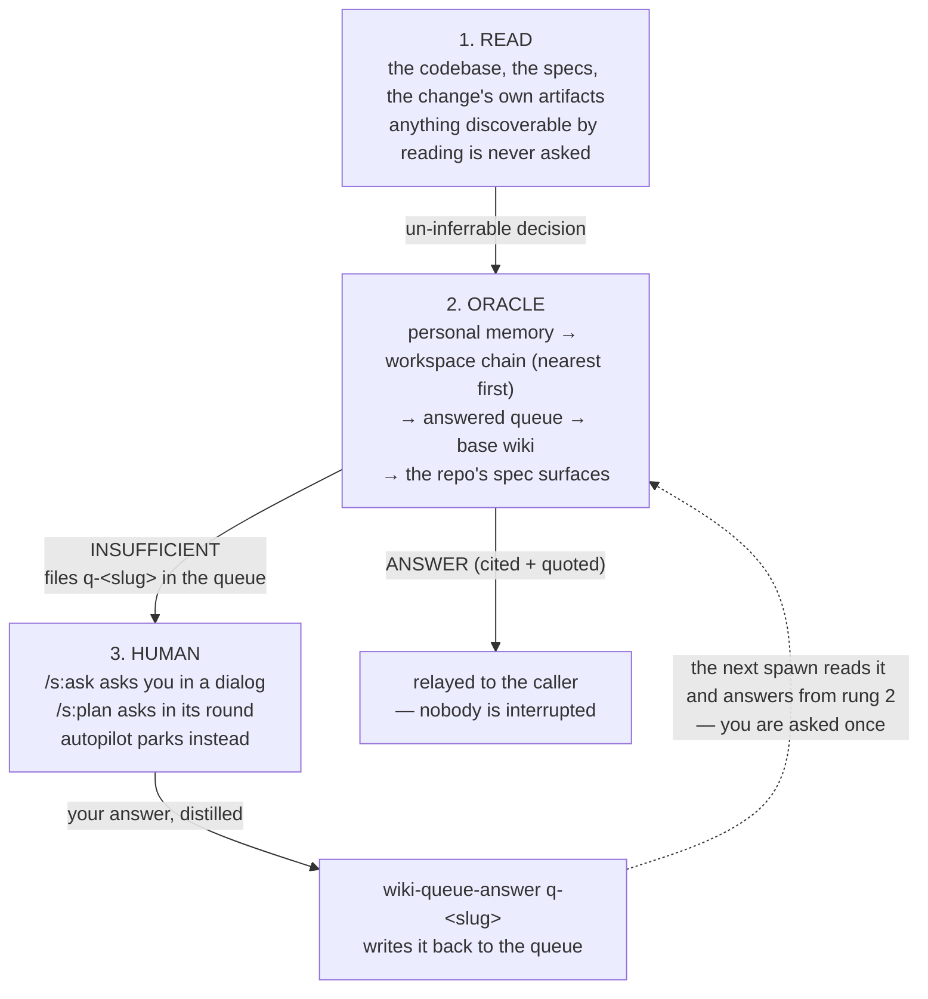

# The oracle

Some decisions can't be read out of the codebase. Which retention window? Which
naming convention? Which of two equally defensible layouts does this team
actually use? Historically the only way to settle one was to interrupt a human.

The **oracle** is the rung in between. It is a non-interactive
sub-agent (`s:oracle`) that takes **one compact decision** — the decision, its
options, and your recommended default — searches the durable knowledge the
workspace already holds, and returns one of exactly two verdicts: a **cited
recommendation**, or an **admission that nobody has decided this yet**, filed
as a question for a person.

It never asks you anything and never blocks its caller. Every spawn ends in a
verdict.

## The ladder

The oracle sits in the middle of a three-rung ladder: **read → oracle →
human**. Each rung is cheaper than the one above it, so you only climb when the
rung below comes up empty.



That last arrow is the point: **an answer you give once is captured**, so the
same question never reaches you twice. `/s:teach` later distills answered queue
entries into proper wiki pages, which is where the knowledge finally settles.

## The two verdicts

The oracle's reply always begins with a first line of exactly `ANSWER` or
`INSUFFICIENT`, so callers branch on it mechanically.

### `ANSWER` — somebody already decided this

```
ANSWER
Use a single append-only log with per-entry timestamps; it matches how the
store already records provenance and keeps readers grep-friendly.
Cited: [[logging-conventions]]
Cited: verified/shipd-wiki
Evidence: [[logging-conventions]] — "Every store event appends one dated line
to log.md; entries are never rewritten in place."
```

Every `ANSWER` carries:

- **one position**, not a menu of alternatives — you asked for an opinion;
- **`Cited:` line(s)** naming what backs it — a wiki page as `[[slug]]`, an
  answered queue entry as `queue q-<slug>`, or a repo artifact
  (`verified/<capability>`, `epic/<slug>`, `research/<slug>`). A page from the
  personal memory store is marked `(personal)`, one from an enclosing
  workspace's inherited store `(inherited <ws-root>)`, and one from a base
  store `(base)`, so you can see which store answered;
- **at least one `Evidence:` line** quoting a cited source **verbatim**.

### `INSUFFICIENT` — nobody has decided this yet

```
INSUFFICIENT
Question: Which retention window should the queue enforce for answered entries?
Options: keep forever | prune after 90 days | prune after one release
Recommendation: prune after one release
Queued: q-answered-queue-retention
```

The compact question is filed in the workspace wiki's queue as
`q-answered-queue-retention` with `Answer: pending`, and the caller takes it
from there — `/s:ask` puts it to you in a dialog, `/s:plan` folds it into its
question round, and an unattended autopilot run parks on the recommendation
rather than blocking. When the repo has no discoverable workspace the line
reads `Queued: none`: there is no store to file it in, so an answer you give
is used for that session only and nothing durable is written.

## The bar: definitive evidence, or nothing

**`INSUFFICIENT` is the oracle's default verdict.** It is a retrieval rung, not
a consultant, and it speaks only for what the sources actually say:

- **It never answers from model knowledge.** Its own view of your decision,
  however sensible, is not evidence.
- **Topical relevance is not enough.** A page about caching does not answer
  "which TTL". `ANSWER` requires a source that states a position on the
  *specific* decision asked — which is what the verbatim `Evidence:` quote lets
  you check at a glance.
- **Callers enforce it too.** `/s:ask` and `/s:plan` demote an `ANSWER` that
  arrives without a `Cited:` or an `Evidence:` line back to `INSUFFICIENT` and
  ask you instead. A demotion costs one question; a confident guess costs a
  wrong decision.

So a thin wiki produces a lot of `INSUFFICIENT` — by design. Each one you
answer is captured, and the store gets thicker.

## Using it directly

```
/s:ask should the queue prune answered entries, and after how long?
```

The skill shapes your request into a compact question (no interview round),
spawns the oracle, and relays the verdict. On `INSUFFICIENT` it asks you the
question in a single dialog with the oracle's recommendation listed first,
distills your reply, and writes it back to the queued entry — so the next
caller to hit that decision gets an `ANSWER`.

`/s:plan` consults the same rung automatically before any question round it
would otherwise open, and captures your typed answers the same way. You do not
invoke the oracle there; you just get asked less.

## Correcting an answer

The capture path writes an answer **once**: `wiki-queue-answer` refuses a block
that is already answered, so nothing silently overwrites what a human said.

Corrections go through **`/s:teach`**, which is the sole distiller of queue
entries into wiki pages. Run it to drain answered entries into pages, and edit
the decision there — a page outranks a raw queue entry on the oracle's ladder,
so the corrected page is what future spawns cite. During planning, the same
path is named per consultation as `/s:teach <change> Q<n>`.

And a typed answer always supersedes the oracle: you are the final authority,
the wiki merely caches your standing answer.

## See also

- [What is shipd?](what-is-shipd.md) — where the oracle sits in the workflow.
- [Portable workspaces](portable-workspaces.md) — the workspace that holds the
  wiki store the oracle reads and queues into.
