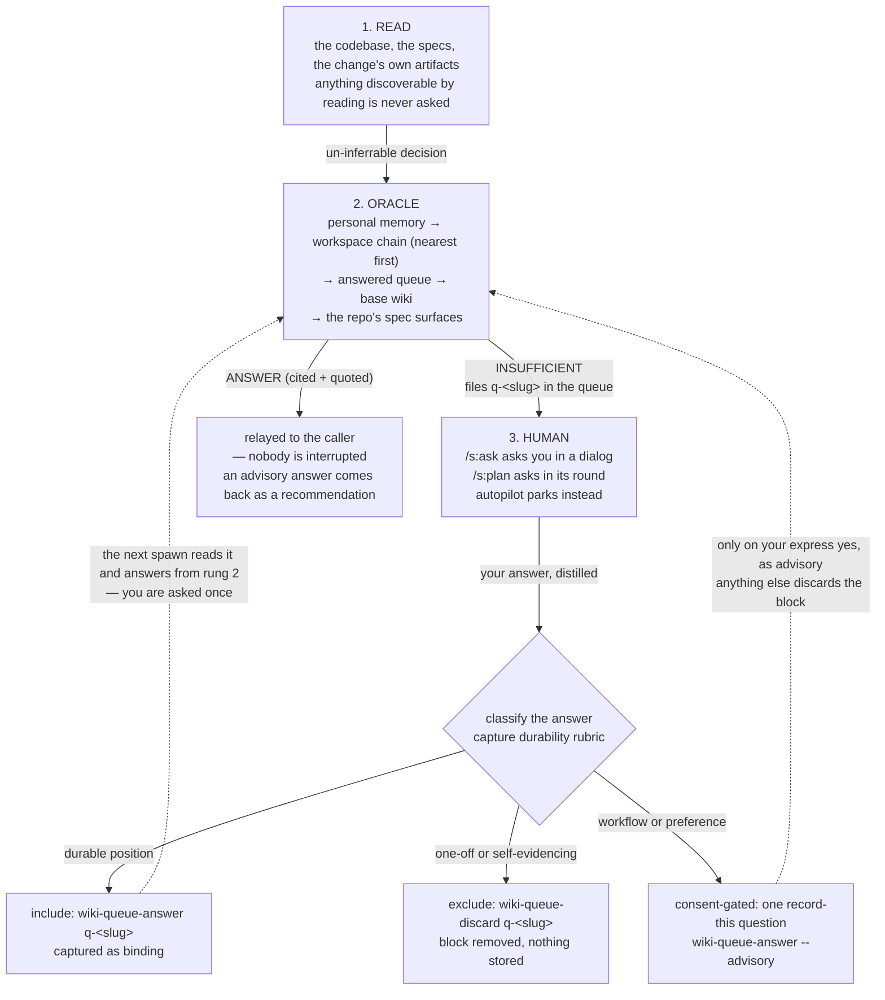

<!-- doc-type: reference -->

# The oracle

Some decisions do not live in the codebase. Which retention window? Which
naming convention? Which of two defensible layouts does this team use?
Settling one used to mean interrupting a human.

The **oracle** is the rung in between. It is a non-interactive sub-agent
(`s:oracle`). It takes one compact decision — the decision, its options, and
your recommended default. It searches the durable knowledge the workspace
already holds. It returns one of exactly two verdicts: a cited recommendation,
or an admission that nobody has decided this yet.

The oracle never asks you anything and never blocks its caller. Every spawn
ends in a verdict.

## The ladder

The oracle sits in the middle of a three-rung ladder: read, then oracle, then
human. Each rung costs less than the one above it. You climb only when the
rung below comes up empty.



The dotted arrows back to rung 2 carry the point. An answer you give once can
become standing knowledge, so the same question never reaches you twice. Not
every answer earns that. The capture path classifies your reply before it
writes anything, and only the durable kind settles into the store (see
[What gets captured](#what-gets-captured)). `/s:teach` later distills the
captured queue entries into proper wiki pages.

## The two verdicts

The oracle's reply always opens with a first line of exactly `ANSWER` or
`INSUFFICIENT`. Callers branch on that line mechanically.

### `ANSWER` — somebody already decided this

```
ANSWER
Use a single append-only log with per-entry timestamps; it matches how the
store already records provenance and keeps readers grep-friendly.
Cited: [[logging-conventions]]
Cited: verified/shipd-wiki
Evidence: [[logging-conventions]] — "Every store event appends one dated line
to log.md; entries are never rewritten in place."
```

Every `ANSWER` carries:

- **one position**, not a menu of alternatives. You asked for an opinion.
- **`Cited:` lines** naming what backs the position: a wiki page as
  `[[slug]]`, an answered queue entry as `queue q-<slug>`, or a repo artifact.
- **at least one `Evidence:` line** quoting a cited source verbatim.

A repo artifact cites as `verified/<capability>`, `epic/<slug>`, or
`research/<slug>`. Each `Cited:` line also names its store. The oracle marks a
personal memory page `(personal)`, a page from an enclosing workspace
`(inherited <ws-root>)`, and one from a base store `(base)`.

#### The advisory variant

Not everything the oracle knows is a rule. Workflow shortcuts, process habits,
and personal preferences reach the store only on your express instruction, as
**advisory** knowledge (see [What gets captured](#what-gets-captured)). When an
answer rests on such a source, the `ANSWER` carries an `Authority: advisory`
line right after its position:

```
ANSWER
Squash-merge each change branch with an imperative one-line subject.
Authority: advisory
Cited: queue q-merge-style
Evidence: queue q-merge-style — "advisory: always squash-merge with imperative
one-line subjects"
```

Advisory is not a third verdict. The first line stays `ANSWER`, so callers
branch exactly as before and then check for the authority line.

The line changes what the caller does with the answer. An advisory `ANSWER`
acts as a **recommended, citable default, not a settlement**. `/s:ask` puts the
decision to you. It lists the oracle's position as the recommended-first
option, names its citation, and lets you accept or override it in one
keystroke. Nothing settles behind your back on a preference you once expressed.

An `ANSWER` with **no** `Authority:` line is binding, as before. Somebody made
the decision, the citation says where, and the oracle never asks you again.

### `INSUFFICIENT` — nobody has decided this yet

```
INSUFFICIENT
Question: Which retention window should the queue enforce for answered entries?
Options: keep forever | prune after 90 days | prune after one release
Recommendation: prune after one release
Queued: q-answered-queue-retention
```

The oracle files the compact question in the workspace wiki's queue as
`q-answered-queue-retention`, carrying `Answer: pending`. The caller takes it
from there. `/s:ask` puts it to you in a dialog. `/s:plan` folds it into its
question round. An unattended autopilot run parks on the recommendation rather
than blocking.

When the repo has no discoverable workspace, the line reads `Queued: none`. No
store exists to file the question in, so an answer you give holds for that
session only, and nothing durable lands.

## The bar: definitive evidence, or nothing

**`INSUFFICIENT` is the oracle's default verdict.** The oracle is a retrieval
rung, not a consultant, and it speaks only for what its sources actually say:

- **It never answers from model knowledge.** Its own view of your decision,
  however sensible, is not evidence.
- **Topical relevance is not enough.** A page about caching does not answer
  "which TTL". `ANSWER` needs a source that states a position on the *specific*
  decision asked.
- **Callers enforce the bar too.** `/s:ask` and `/s:plan` demote an `ANSWER`
  that arrives without a `Cited:` or an `Evidence:` line, and ask you instead.

The verbatim `Evidence:` quote is what lets you check that bar at a glance. A
demotion costs one question. A confident guess costs a wrong decision.

So a thin wiki produces many `INSUFFICIENT` verdicts, by design. Each one you
answer with a durable position thickens the store.

## Using it directly

```
/s:ask should the queue prune answered entries, and after how long?
```

The skill shapes your request into a compact question, spawns the oracle, and
relays the verdict. It opens no interview round.

On an advisory `ANSWER` it puts the decision to you, with the oracle's position
recommended first and cited, rather than treating it as settled. On
`INSUFFICIENT` it asks you the question in a single dialog, listing the
oracle's recommendation first. It then distills your reply, classifies it, and
writes a keepable answer back to the queued entry. The next caller to hit that
decision gets an `ANSWER`.

`/s:plan` consults the same rung automatically before any question round it
would otherwise open. It puts your typed answers through the same
classification. You never invoke the oracle there; you simply get asked less.

## What gets captured

The capture path classifies your typed answer **before any queue write**. The
queue is a pending-only worklist, and the wiki is standing knowledge. A one-off
decision or a passing preference must not silently become either. Every
distilled reply lands in exactly one of three tiers. The shipped rubric is
`plugins/s/skills/ask/references/capture-rubric.md`.

**Include — captured as binding.** Durable engineering positions shape future
work, and no single repo artifact already evidences them. Examples: "never
hard-delete; soft-delete flags plus an audit log", "async accessors are
`fetch*`, never `get*`". `wiki-queue-answer` writes them to the queued entry.
The oracle later relays them as binding `ANSWER` verdicts that settle the
decision without asking you again.

**Exclude — discarded, nothing stored.** Some answers already have a better
durable record, or scope explicitly to one change. Examples: "pin Node 22 in
`.nvmrc`" (the file is its own record), "ship this migration without a
rollback, just this once". `wiki-queue-discard` removes the pending block
with a one-line reason and writes nothing to the wiki. The change's own plan
ledger still records how the decision went. A stale copy of a self-evidencing
fact is worse than no copy.

**Consent-gated — advisory, and only if you say so.** These are workflow
shortcuts, process habits, and personal preferences. Examples: "always
squash-merge", "stop asking and just run the unlock instead". The capture path
**never infers them** — a vented annoyance is not a standing instruction. You
get one explicit record-this question, and only your express affirmative
captures, always via `wiki-queue-answer --advisory`. Declined, deferred, or
left unaddressed, the block goes the way of an excluded one. What lands this
way is exactly what comes back later carrying `Authority: advisory`:
recommended, never forced.

For a preference about you rather than about the workspace, `/s:remember` and
the personal memory store are usually the better home.

A borderline answer leans toward the *less*-capturing tier. An answer left
uncaptured costs one future question; one captured wrongly silently steers
work. Where the verdict reported `Queued: none`, no store exists to write to at
all: your answer holds for that session, and nothing durable lands.

## Correcting an answer

The capture path writes an answer **once**. `wiki-queue-answer` refuses a block
that already carries an answer, so nothing silently overwrites what a human
said.

Corrections go through **`/s:teach`**, the sole distiller of queue entries into
wiki pages. Run it to drain answered entries into pages, then edit the decision
on the page. A page outranks a raw queue entry on the oracle's ladder, so
future spawns cite the corrected page. During planning, the same path appears
per consultation as `/s:teach <change> Q<n>`.

A typed answer always supersedes the oracle. You are the final authority, and
the wiki merely caches your standing answer.

## See also

- [What is shipd?](what-is-shipd.md) — where the oracle sits in the workflow.
- [Workspaces](workspaces.md) — the workspace that holds the wiki store the
  oracle reads and queues into.
