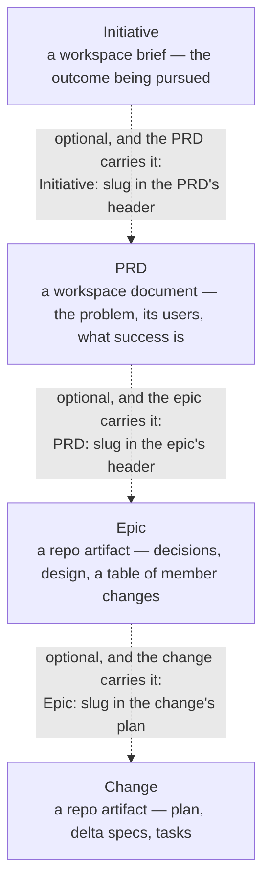

# PRDs

Before anything is decomposed into epics and changes, someone has to settle
what problem is being solved, for whom, and what success looks like. That is
the **discover phase**, and shipd captures it as an artifact rather than a
conversation: a **PRD** — a Product Requirements Document — written against a
template, validated by the engine, and stored where every project in the
workspace can read it.

A PRD sits above epics. The full hierarchy is
**Initiative → PRD → Epic → Change**, and **every link in it is optional**: the
lower artifact names the higher one in its own header, or names nothing at all.
A PRD with no initiative is normal. A PRD no epic ever cites is still a PRD.



The arrows point down the hierarchy, but every reference is written **upward**:
the PRD names its initiative, the epic names its PRD, the change names its
epic. Nothing higher up ever lists what points at it, which is why removing a
PRD's consumers never invalidates the PRD.

## Where a PRD lives

**In the workspace, not the repository.** A PRD's home is the workspace root's
content directory, beside the initiative briefs and the wiki:

```
~/workspaces/notifications/        ← the workspace root
  .shipd-config.json
  .shipd/
    wiki/                          ← the job's knowledge store
    initiatives/<slug>/brief.md    ← the outcomes being pursued
    prds/mobile-push/prd.md        ← THE PRD
    projects/
  documents/  tasks/               ← member repos
```

The resolved path is `<workspace-root>/<content-dir>/prds/<slug>/prd.md` — the
content directory read from the workspace root's own configuration, `.shipd` by
default. The directory name *is* the slug, and the document's `# ` title has to
match it.

Storing PRDs in the workspace rather than in a member repo is what makes them
shared: a PRD about push notifications is read the same way from the API repo,
the mobile repo, and the workspace root, because none of them owns it. See
[Workspaces](workspaces.md) for what a workspace is and how one is set up.

**Resolution walks the workspace chain.** A slug resolves at the nearest chain
member that holds it, exactly as an initiative brief does. So a job workspace
nested beneath a base workspace inherits the base's PRDs, and a PRD of the same
slug in the nested job shadows the base's. Nothing is copied.

**No workspace means no PRD.** There is no repo-local fallback — a PRD written
beside the code is a PRD no other project can read, so the engine refuses to
write one when no ancestor `.shipd-config.json` declares a workspace, and
`/s:prd` stops at that refusal rather than inventing a home. The fix is to
create one:

```sh
shipd workspace init notifications --git
```

**A PRD is standalone.** It needs no initiative and no epic, ever. The
`Initiative:` line is the only optional metadata key a PRD header recognizes,
and epics cite the PRD rather than the other way round — so a PRD can be
written, approved, and read on its own, and be decomposed later or never.

## Lifecycle

A PRD is a document, not a change, so it carries its own three-value status
vocabulary — deliberately not the change statuses:

| Status | Meaning |
| --- | --- |
| `draft` | Being written. Every PRD is authored at this status. |
| `approved` | Signed off. The problem statement is settled. |
| `superseded` | Replaced by a later PRD. Kept for the record, not for work. |

The status lives on a `Status:` line in the header, among the document's first
five non-blank lines, alongside the mandatory `Template:` line naming its tier:

```
# mobile-push
Status: draft
Template: standard
Initiative: retention
```

**Advancing the status is a re-install, never a hand edit.** There is no status
verb for a PRD. To approve one, you edit a copy of the document with
`Status: approved`, and `/s:prd` re-installs it through the engine's staged
emit with a replace flag. The engine copies the staged file into place,
validates the result, and — on any finding — removes what it just staged,
restores the document it replaced, and exits non-zero. Nothing half-written
ever lands in the store, which is precisely why the store is not edited
directly.

You can check a single PRD against that same validation at any time:

```sh
shipd lint --prd mobile-push
```

## Templates

The engine defines three template tiers, and the plugin ships one skeleton per
tier. Their required sections are **exact level-2 headings**, and the tiers
**nest additively** — every section a lower tier requires, the higher tier
requires too:

| Tier | Required sections |
| --- | --- |
| `basic` | `## Problem`, `## Solution`, `## Success criteria` |
| `standard` | `basic`'s three, plus `## Users`, `## Requirements`, `## Non-goals` |
| `comprehensive` | `standard`'s six, plus `## Risks`, `## Rollout`, `## Open questions` |

**`standard` is the default.** `basic` is for a small, self-contained idea
whose users and scope are obvious; `comprehensive` is for blast radius across
several projects, regulatory or risk weight, a phased rollout, or several
distinct user classes.

The nesting is what makes a mid-interview tier switch cheap. Escalating from
`standard` to `comprehensive` only *adds* sections to cover — nothing already
answered is invalidated. De-escalating keeps the extra answers as sections
beyond the tier's list, which is fine, because the tier list is a **floor, not
a ceiling**: validation requires every section the declared tier names and
allows any number of sections beyond them.

Two header rules complete the contract. The `Template:` line is mandatory and
its value must name one of the three tiers — an absent or unknown value is an
error rather than a silent default to `standard`. And `Initiative:` is the only
other recognized key: any other key is rejected, and a value that resolves to
no brief in the workspace chain fails validation.

## The `/s:prd` interview

`/s:prd` is how PRDs get written. It is an interrogation, not a form: it
investigates first, then grills you section by section, and ends at an
installed document. The skill's own contract is the authority on its behavior;
what follows is the shape of a session.

```sh
/s:prd notifications for documents shared with me
```

1. **Preflight.** It announces the running plugin version, then resolves the
   workspace. No workspace, no interview — it reports the engine's error, says
   that PRDs live in the workspace rather than the repository, and points you
   at workspace initialization. Nothing is written.

2. **Investigation, before a single question.** It runs the engine's superset
   search over your terms — the spec library, the wiki, the workspace's
   initiative briefs and existing PRDs, and this repo's git-tracked files — and
   reads what ranked highest. Anything discoverable by reading is never asked;
   what investigation found arrives in the questions as stated context. The
   same search doubles as the duplicate guard: if a PRD already covers this
   ground, you are told before the interview starts and choose between
   extending it and writing a distinct one.

3. **Tier selection, announced.** It states the active tier and its reason in
   one sentence, starting from `standard`, and announces any escalation or
   de-escalation the moment it happens rather than at the end.

4. **The interview, one section per round.** Each round covers a single
   template section with two to four focused questions, options offered with a
   recommended default first, and the answers folded in before the next round
   opens. Thin answers get pressed rather than written down — "faster" is not a
   success criterion, "power users" is not a user class — and a section with no
   substance behind it is a reason to keep asking, never a reason to author
   plausible filler. The slug is settled in the first round, because it is both
   the directory name and the title.

5. **Compose and install.** It fills the active tier's skeleton, replacing each
   italic guidance line wholesale, writes the result to a staging file, and
   installs it through the engine's staged emit — the only way a PRD is written.
   On a validation finding it fixes the staged file and re-runs; nothing was
   installed. It then reads the installed document back through the engine as
   confirmation that it landed.

6. **Handoff.** It summarizes what the interview settled, states that approval
   is a re-install of the edited document, and points at `/s:epic` without
   invoking it. Decomposition is a separate act, taken when you decide to take
   it.

Because the PRD lands in the workspace, outside the repository, none of this
touches the repo's worktree-and-branch workflow: there is no branch and no pull
request for a PRD.

An epic born from a PRD carries the link in its header:

```
# push-delivery
PRD: mobile-push
```

The epic linter resolves that slug across the workspace chain whenever a
workspace is discoverable, and rejects a value that resolves to nothing, naming
the path it expected. In a checkout with no discoverable workspace — a bare CI
runner, for instance — the check is skipped silently, so repository lint never
depends on files outside the repository.

## Finding PRDs

`shipd search` is the retrieval surface that lists PRDs. It ranks a wide
corpus — the spec library, epics, research and installed documents, the
workspace wiki, the workspace's initiative briefs **and PRDs**, and the
invoking repo's git-tracked files — by case-insensitive term-hit count:

```sh
shipd search mobile push notifications
```

```
kind: prd
slug: mobile-push
score: 34
path: /Users/you/workspaces/notifications/.shipd/prds/mobile-push/prd.md

kind: epic
slug: push-delivery
score: 12
path: .shipd/epics/push-delivery/epic.md

kind: code
slug: src/notify/apns.py
score: 9
path: src/notify/apns.py

… and 4 more
```

Each match prints as a four-line block — `kind`, `slug`, `score`, `path` — with
`kind: prd` marking a PRD. Paths are relative to the invocation root when the
artifact lives inside it and absolute otherwise, which is why a workspace PRD
reports an absolute path from a member repo. At most ten blocks print; the rest
are counted on the trailing line. Add `--json` for the same rows as one
machine-readable document.

Note that the workspace roster report — `shipd workspace` — lists the
workspace's projects and initiatives, but **not** its PRDs. `search` finds a
PRD by what it says; `shipd prd`, below, lists and reports on them by slug.

## Inspecting PRDs

`shipd prd <slug>` prints one PRD's report — its header facts, where the slug
resolved, and which epics cite it:

```sh
shipd prd mobile-push
```

```
mobile-push: approved
Template: standard
Initiative: q3-activation
path: /Users/you/workspaces/notifications/.shipd/prds/mobile-push/prd.md
cited-by: push-delivery (active)
cited-by: push-analytics (draft)
```

The `Initiative:` line prints only when the header carries one. The `path:` is
where the slug actually resolved on the workspace chain — relative when it
lives inside the invocation root, absolute otherwise, which is the usual case
for a workspace PRD read from a member repo.

The `cited-by:` lines are the reverse of the epic header's `PRD:` link, which
the PRD itself does not record. They are derived by reading the epics of the
repository you invoke from — that repo and its worktrees, so an epic still
sitting on a branch counts — and no further: epics in *other* repos of the
workspace are not scanned. A PRD no epic cites prints one explicit line:

```
cited-by: none
```

Bare `shipd prd` lists the roster instead — every PRD the workspace chain
holds, one line per slug, sorted:

```sh
shipd prd
```

```
mobile-push: approved (standard)
quiet-hours: draft (basic)
weekly-digest: superseded (comprehensive)
```

A slug held by more than one chain member appears once, showing the nearest
member's copy — the same shadowing that decides which document `shipd prd
<slug>` reports on. A chain holding no PRDs at all reports the empty store
rather than failing. Both forms accept `--json` for the same facts as one
machine-readable document.

The report is a set of facts, not the document: to read the PRD itself, hand
the report's `path:` line to the markdown viewer.

```sh
shipd render ~/workspaces/notifications/.shipd/prds/mobile-push/prd.md
```

## FAQ

**Where is a PRD stored?** In the workspace, at
`<workspace-root>/<content-dir>/prds/<slug>/prd.md` — `.shipd/prds/<slug>/prd.md`
with the default content directory. Not in the member repo, and not on a
branch. Resolution walks the workspace chain, so a nested job workspace also
sees the PRDs of the workspace it is nested under. To see what that resolves to
from where you stand, `shipd prd` lists the roster and `shipd prd <slug>`
reports the resolved path; `shipd search` ranks the same store by content.

**Is a PRD always tied to an epic?** No, and the direction matters: an epic
cites a PRD by carrying `PRD: <slug>` in its own header, but a PRD holds no
list of its epics and knows nothing about them. One PRD can be decomposed into
several epics, or into none at all. Deleting or never writing the epic leaves
the PRD untouched.

**Can a PRD exist by itself?** Yes. Neither link is required: `Initiative:` is
optional, no epic has to cite it, and a standalone PRD is a perfectly ordinary
outcome. It stays a useful record of what problem was being solved and what
success would have looked like, whether or not anything was ever built from it.

**Can I edit the file in the store directly?** Don't. Validation runs on
install, so a hand edit bypasses the one gate that keeps the store lint-clean —
and the restore-on-failure behavior that protects the previous version only
exists on the install path. Edit a copy and re-install it through `/s:prd`.
