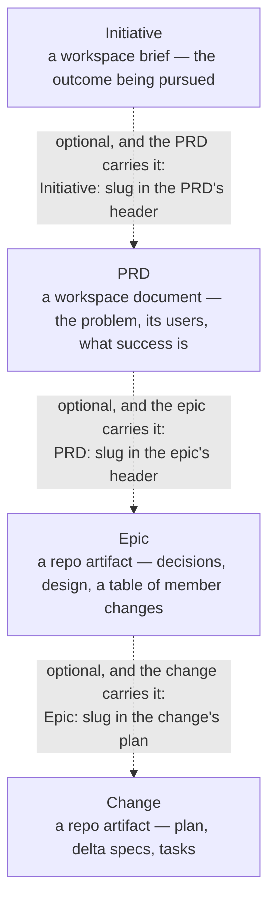

<!-- doc-type: concept -->

# PRDs

Before anyone decomposes a feature into epics and changes, someone has to
settle what problem it solves, for whom, and what success looks like. That is
the **discover phase**, and shipd captures it as an artifact. A **PRD** — a
Product Requirements Document — follows a template, passes the engine's
validation, and lands where every workspace project reads it.

The header keys, the statuses, the tiers, and the command surfaces live in
[PRD reference](prd-reference.md). This page covers the concept.

## The hierarchy

A PRD sits above epics. The full hierarchy is
**Initiative → PRD → Epic → Change**, and **every link in it is optional**. The
lower artifact names the higher one in its own header, or names nothing at all.
A PRD with no initiative is normal. A PRD no epic ever cites is still a PRD.



The arrows point down the hierarchy, but each artifact writes its reference
**upward**. The PRD names its initiative, the epic names its PRD, and the
change names its epic. Nothing higher up ever lists what points at it, which is
why removing a PRD's consumers never invalidates the PRD.

## Where a PRD lives

**In the workspace, not the repository.** A PRD's home is the workspace root's
content directory, beside the initiative briefs and the wiki, at
`<workspace-root>/<content-dir>/prds/<slug>/prd.md`. The directory name *is*
the slug, and the document's `# ` title has to match it.

Workspace storage is what shares a PRD. The API repo, the mobile repo, and the
workspace root all read it the same way, because none of them owns it. See
[Workspaces](workspaces.md) for what a workspace is and how you set one up.

**Resolution walks the workspace chain.** A slug resolves at the nearest chain
member that holds it, exactly as an initiative brief does. So a job workspace
nested beneath a base inherits the base's PRDs. A same-slug PRD in the nested
job shadows the base's copy, and the engine copies nothing.

**No workspace means no PRD.** No repo-local fallback exists: a PRD written
beside the code is a PRD no other project can read. So the engine refuses to
write one when no ancestor `.shipd-config.json` declares a workspace. `/s:prd`
stops at that refusal rather than inventing a home. Run
`shipd workspace init <name> --git` first.

**A PRD is standalone.** It needs no initiative and no epic, ever. Epics cite
the PRD rather than the other way round, so a PRD holds no list of its epics.
You can write, approve, and read a PRD on its own, and decompose it later or
never.

## Lifecycle and tiers

A PRD carries its own three-value status vocabulary. A PRD reads `draft` while
someone writes it, `approved` once the problem statement settles, and
`superseded` once a later PRD replaces it. Advancing that status is a
**re-install of the edited document**, never a hand edit of the store.
Validation and restore-on-failure live only on the install path.

Every PRD declares one of three template tiers in its header. `basic` covers a
small, self-contained idea; `standard` is the default; `comprehensive` covers
blast radius, risk weight, a phased rollout, or several user classes. The tiers
nest additively, so escalating mid-interview only adds sections to cover.
[PRD reference](prd-reference.md) lists each tier's exact sections.

## Writing one

`/s:prd` writes PRDs. It is an interrogation, not a form. It investigates the
workspace and the repo first, then grills you section by section, and ends at
an installed document.

```sh
/s:prd notifications for documents shared with me
```

The interview resolves the workspace, searches for prior art, and announces its
tier. It covers one template section per round, then installs the result
through the engine's staged emit. It hands off to `/s:epic` without invoking it.

Because the PRD lands in the workspace, outside the repository, none of this
touches the repo's worktree-and-branch workflow. A PRD has no branch and no
pull request.

## See also

- [PRD reference](prd-reference.md) — header keys, statuses, tiers, commands.
- [Workspaces](workspaces.md) — the workspace that stores every PRD.
