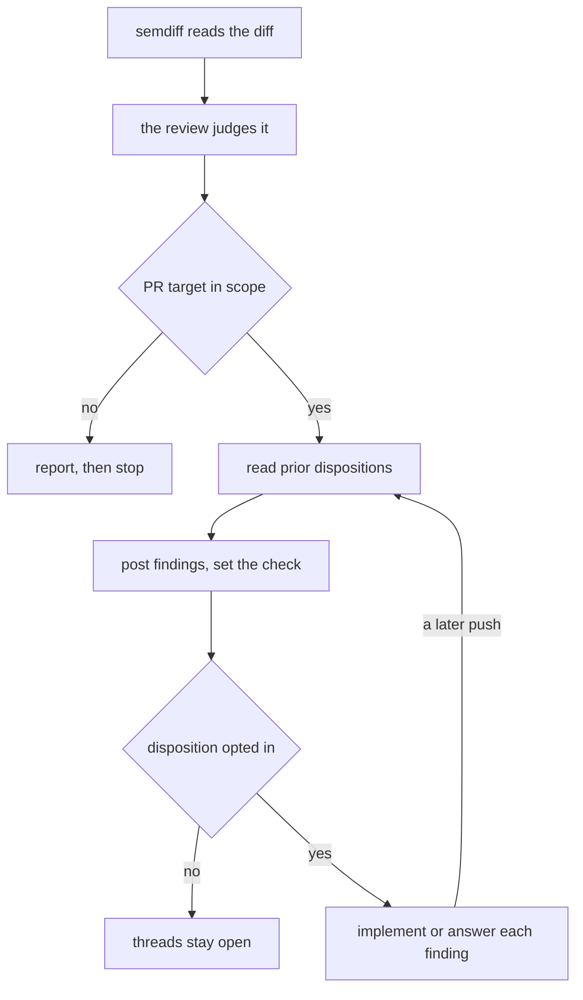

<!-- doc-type: concept -->

# The semantic review

The semantic review reads a change structurally. It compares two refs through
`semdiff`, reasons over syntax-aware hunks, and reports findings a person can
act on. It never reads whole files when the structural diff will do.

`/s:review` runs it. On a pull request, the `semantic-review` check carries its
verdict.

## What it reads

`semdiff` performs the mechanical work and emits compact JSON. Six subcommands
serve the review:

| subcommand | what it returns |
|---|---|
| `files` | changed paths, grouped into architectural cohorts |
| `diff` | syntax-aware hunks, with formatting noise stripped |
| `context` | the references to a changed symbol |
| `change` | a planned change's deltas, tasks, and lint findings |
| `lint` | findings from the repository's own linters |
| `doctor` | the tools available on this machine |

The engine supplies the facts. The reviewer supplies the judgement.

## What it looks for

The review works cohort by cohort, foundational layers first. Three of its
passes look past the changed lines themselves:

- **Downstream impact.** A changed signature, limit, or timeout breaks a
  contract, so the review chases every consumer. A consumer the diff never
  touched is the most valuable finding it produces.
- **Call-site values.** The review follows the argument each caller passes. A
  guard the real call never reaches is dead code.
- **Risk lenses.** Five triggers run over every diff: secret or credential
  exposure, authorization boundary, unbounded work, resource release, and
  migration reversibility.

A linter finding is corroboration the reviewer weighs. It never becomes a
review finding on its own.

## Severity and the blocking rule

Every finding carries one of three severities, and the blocking rule is
mechanical:

| severity | meaning | blocks |
|---|---|---|
| high | a correctness bug, a broken contract, an unmet criterion | yes |
| medium | an unhandled edge case, a caller at genuine risk | yes |
| low | style, naming, minor redundancy | no |

Two findings always rate `high`, whatever the reviewer's confidence: an
exposed secret, and an authorization boundary reached without a scope check. A
leaked credential does not wait for confirmation.

## Where it runs

The review takes one of two paths. A local run ends at the report, while a
pull-request run posts to it by default and loops on later pushes.

Before it posts, the review reads back this pull request's findings. It
omits one a reviewer answered with a reasoned reply, and states the omitted
count. It keeps a finding only a commit cleared, since a recurrence after a
fix is a regression. The posted findings stay open for that pull request's
owner; implementing and resolving them is opt-in the invoker asks for. Each
finding carries a hidden identity, hashed from its path and text, with line
numbers excluded so a moved line still matches.

## When a tool is missing

Without `difft` the review stops before any analysis. Difftastic is a hard
requirement, not a fallback engine, because a review whose engine varies
silently produces a verdict nobody can reproduce. A linter that crashes or
times out reports as failed, and the review still completes.

## See also

- [Install the Copilot review gate](copilot-review.md) — run this review on
  every pull request
- [Copilot review reference](copilot-review-reference.md) — the managed files
  and the contract for the check
- [Semantic review reference](semantic-review-reference.md) — the `--json`
  fields, the `lint` key, and `prior`'s output
