# What is shipd?

**shipd** ([shipd.now](https://shipd.now)) is a spec-driven delivery system
for AI coding agents. Instead of prompting an agent and hoping the result
matches what you meant, shipd makes the agent **converge on a specification
first**: it investigates your codebase, asks only the questions it genuinely
cannot answer itself, and compiles your intent into a small set of reviewable
artifacts — a plan, testable requirement deltas, and a mechanical task list.
Only when that spec passes a deterministic context gate does implementation
begin, and the spec — not the chat transcript — is the single source of
context every agent works from. The result is that "what got built" and "what
was asked for" are the same document, checked into your repository.

Around that core loop, shipd runs the whole delivery lifecycle. An
orchestrator on the strongest model plans and designs; execution agents one
tier down claim tasks atomically and implement them; an independent validator
then tries to **refute** every scenario in the spec against the real, running
code before anything merges. Each change lives in its own worktree, branch,
and pull request, gated by CI and a semantic review that must be explicitly
dispositioned — and when it ships, the engine merges the deltas into a
versioned capability library and archives the change, so the system always
knows exactly what it can do. A delivery board, throughput metrics, and an
epic layer turn those archives into live status; a knowledge layer (a
workspace wiki, a personal memory store, and an "ask-first" oracle) means
decisions you have made once are never asked twice; and intent can arrive as
more than text — a screen recording becomes a cited brief, grounded frame by
frame, that flows straight into planning.

Today shipd builds itself — every feature in this repository was planned,
built, validated, reviewed, and shipped by its own pipeline, including an
autopilot that delivers an approved epic's members to merged PRs unattended.
Where it is going is the same loop, opened up: a public, installable
distribution of the plugin and engine; a doctor-checked setup and JSON-first
CLI surfaces for tooling; multi-repo workspaces where initiatives group epics
across projects; and a delivery experience where a team states intent — in
prose, in a brief, on a call recording — and receives verified, auditable
pull requests back. shipd.now is the bet that the scarce resource in
agent-driven development is not code generation but **converged context**,
and that a system which compiles context into specs can ship software you can
trust without watching it type.

## How it fits together

```mermaid
flowchart LR
    subgraph intent [Intent]
        idea["Idea / request"]
        video["Screen recording<br/>→ cited brief"]
        research["Research report"]
    end

    subgraph plan [Plan]
        investigate["Codebase-first<br/>investigation"]
        ladder["Memory → oracle → human<br/>question ladder"]
        spec["Spec artifacts<br/>plan · deltas · tasks"]
        gate{"Context<br/>gate"}
    end

    subgraph build [Build]
        orch["Orchestrator<br/>(strongest model)"]
        agents["Execution agents<br/>(one tier down)"]
        validator["Adversarial validator<br/>refutes every scenario"]
    end

    subgraph ship [Ship]
        review["Semantic review gate<br/>+ CI"]
        pr["Auto-merged PR<br/>one change · one branch"]
    end

    subgraph record [Record]
        library["Verified capability<br/>library"]
        board["Delivery board<br/>metrics · epics"]
    end

    idea --> investigate
    video --> investigate
    research --> investigate
    investigate --> ladder --> spec --> gate
    gate -- ready --> orch
    gate -- insufficient --> ladder
    orch --> agents --> validator
    validator -- refuted --> agents
    validator -- confirmed --> review --> pr
    pr --> library --> board
    library -. "compiled context<br/>for the next change" .-> investigate
```

