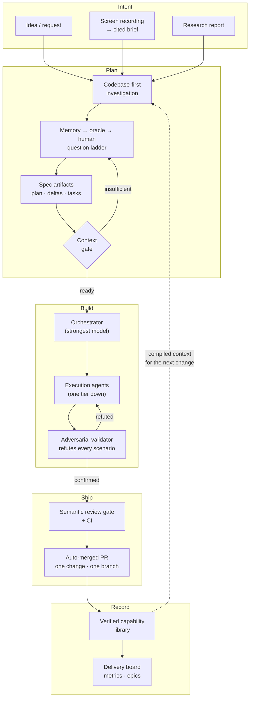

<!-- doc-type: concept -->

# ☕ What is shipd?

☕ **shipd** ([shipd.now](https://shipd.now)) is a spec-driven delivery
system for AI coding agents. Instead of prompting an agent and hoping for
the right result, shipd makes the agent converge on a specification first.
The agent investigates your codebase and asks only what it cannot infer. It
compiles your intent into a small, reviewable artifact set: a plan, testable
requirement deltas, and a task list.

A deterministic context gate must pass before implementation starts. The
spec, not the chat transcript, is the single source of context every agent
works from. That is why "what got built" and "what you asked for" are the
same document, checked into your repository.
[Getting started](getting-started.md) walks you through that loop on your
first change.

Around that core loop, shipd runs the whole delivery lifecycle. An
orchestrator on the strongest model plans and designs the change. Execution
agents one tier down claim tasks atomically and implement them. An
independent validator then tries to refute every scenario in the spec
against the real, running code before anything merges. Each change lives in
its own worktree, branch, and pull request, gated by CI and a semantic
review that a human must explicitly disposition.

When it ships, the engine merges the deltas into a versioned capability
library and archives the change. The system always knows exactly what it
can do. A delivery board, throughput metrics, and an epic layer turn those
archives into live status. A knowledge layer — a workspace wiki, a personal
memory store, and an "ask-first" oracle — means you never answer the same
decision twice. Intent can also arrive as more than text: a screen
recording becomes a cited brief, grounded frame by frame, that flows
straight into planning.

## How it fits together

Today shipd builds itself. Its own pipeline planned, built, validated,
reviewed, and shipped every feature in this repository, including an
autopilot that delivers an approved epic's members unattended. Where it is
going is the same loop, opened up: a public distribution, JSON-first tooling
surfaces, and multi-repo workspaces where initiatives group epics across
projects. A team will state intent in prose, in a brief, or on a call
recording, and receive verified, auditable pull requests back. shipd.now is
the bet that the scarce resource in agent-driven development is not code
generation but **converged context**. A system that compiles context into
specs can ship software you can trust without watching it type.
